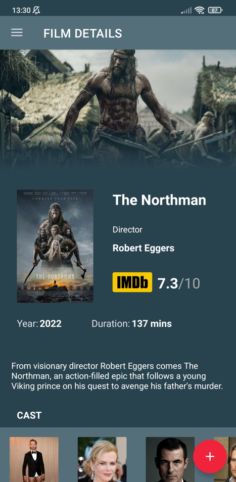

# MovieNerd 🎥🍿
`MovieNerd` is an Android application that uses `IMDB's API` for searching movie ratings.

It's possible to:

- view the Top Rated IMDB's movies.
- view the newest IMDB's movies.
- search for a specific movie in the database.
- manage a watchlist.
- get some achievements on a personal account.

## App Preview

  
  
  
  

